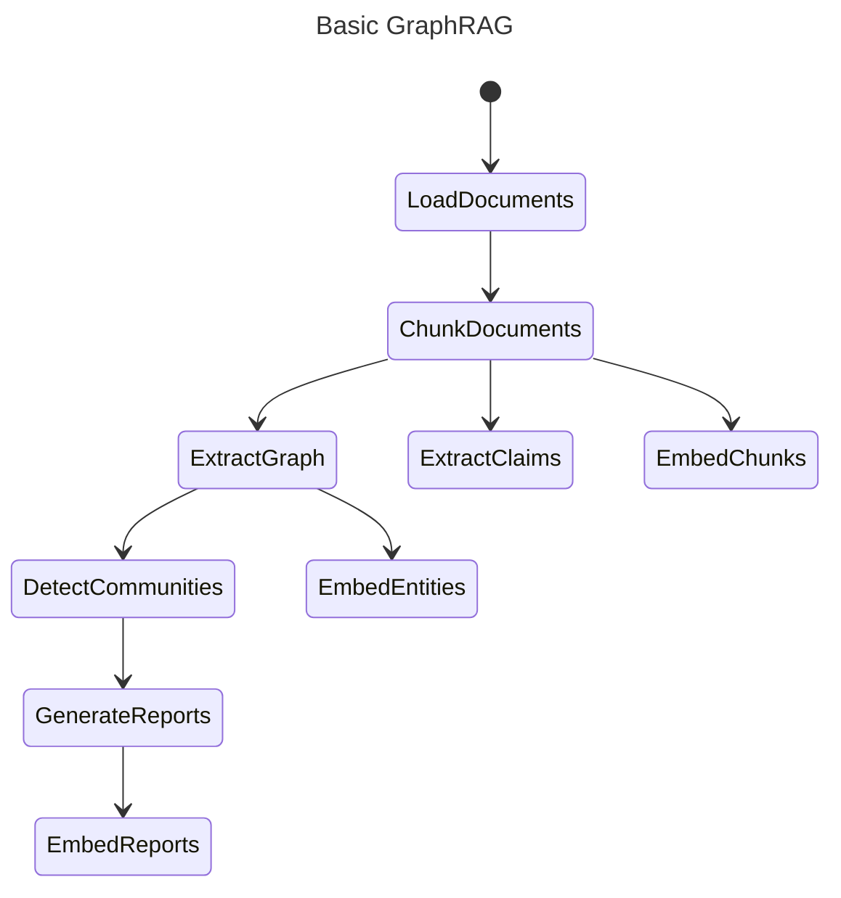

# Indexing Architecture 

## Key Concepts

### Knowledge Model

In order to support the GraphRAG system, the outputs of the indexing engine (in the Default Configuration Mode) are aligned to a knowledge model we call the _GraphRAG Knowledge Model_.
This model is designed to be an abstraction over the underlying data storage technology, and to provide a common interface for the GraphRAG system to interact with.

### Workflows

Below is the core GraphRAG indexing pipeline. Individual workflows are described in detail in the [dataflow](./default_dataflow.md) page.

### LLM Caching

The GraphRAG library was designed with LLM interactions in mind, and a common setback when working with LLM APIs is various errors due to network latency, throttling, etc..
Because of these potential error cases, we've added a cache layer around LLM interactions.
When completion requests are made using the same input set (prompt and tuning parameters), we return a cached result if one exists.
This allows our indexer to be more resilient to network issues, to act idempotently, and to provide a more efficient end-user experience.

### Providers & Factories

Several subsystems within GraphRAG use a factory pattern to register and retrieve provider implementations. This allows deep customization to support your own implementations of models, storage, and so on that we haven't built into the core library.

The following subsystems use a factory pattern that allows you to register your own implementations:

- [language model](https://github.com/microsoft/graphrag/blob/main/graphrag/language_model/factory.py) - implement your own `chat` and `embed` methods to use a model provider of choice beyond the built-in LiteLLM wrapper
- [input reader](https://github.com/microsoft/graphrag/blob/main/graphrag/index/input/factory.py) - implement your own input document reader to support file types other than text, CSV, and JSON
- [cache](https://github.com/microsoft/graphrag/blob/main/graphrag/cache/factory.py) - create your own cache storage location in addition to the file, blob, and CosmosDB ones we provide
- [logger](https://github.com/microsoft/graphrag/blob/main/graphrag/logger/factory.py) - create your own log writing location in addition to the built-in file and blob storage
- [storage](https://github.com/microsoft/graphrag/blob/main/graphrag/storage/factory.py) - create your own storage provider (database, etc.) beyond the file, blob, and CosmosDB ones built in
- [vector store](https://github.com/microsoft/graphrag/blob/main/graphrag/vector_stores/factory.py) - implement your own vector store other than the built-in lancedb, Azure AI Search, and CosmosDB ones built in
- [pipeline + workflows](https://github.com/microsoft/graphrag/blob/main/graphrag/index/workflows/factory.py) - implement your own workflow steps with a custom `run_workflow` function, or register an entire pipeline (list of named workflows)

The links for each of these subsystems point to the source code of the factory, which includes registration of the default built-in implementations. In addition, we have a detailed discussion of [language models](../config/models.md), which includes and example of a custom provider, and a [sample notebook](../examples_notebooks/custom_vector_store.ipynb) that demonstrates a custom vector store.

All of these factories allow you to register an impl using any string name you would like, even overriding built-in ones directly.

---

# 日本語訳

# インデックスのアーキテクチャ

## 主要概念

### Knowledge Model

GraphRAG システムを支えるために、インデックスエンジンの出力は、デフォルト設定モードにおいて、私たちが _GraphRAG Knowledge Model_ と呼ぶ knowledge model に揃えられます。
この model は、下層のデータ保存技術を抽象化し、GraphRAG システムがやり取りするための共通 interface を提供するよう設計されています。

### Workflows

以下は GraphRAG の中核となる indexing pipeline です。各 workflow の詳細は [dataflow](./default_dataflow.md) ページにあります。

### LLM Caching

GraphRAG ライブラリは LLM とのやり取りを前提に設計されており、LLM API を使うとネットワーク遅延や throttling などに起因するさまざまなエラーが起きることがあります。
こうしたエラーケースに備えるため、LLM とのやり取りの周囲に cache layer を追加しています。
同じ入力集合（prompt と tuning parameter）で completion request が来た場合、既存の cache があればその結果を返します。
これにより、indexer はネットワーク障害に対してより強くなり、冪等に動作し、利用者にとってより効率的な体験を提供できます。

### Providers & Factories

GraphRAG 内のいくつかの subsystem では、provider 実装を登録・取得するために factory pattern を使っています。これにより、core library にまだ組み込んでいない model や storage などを、深くカスタマイズして差し替えられます。

次の subsystem は、自前の実装を登録できる factory pattern を使っています。

- [language model](https://github.com/microsoft/graphrag/blob/main/graphrag/language_model/factory.py) - 組み込みの LiteLLM ラッパー以外の model provider を使うために、自前の `chat` と `embed` メソッドを実装できます
- [input reader](https://github.com/microsoft/graphrag/blob/main/graphrag/index/input/factory.py) - text、CSV、JSON 以外の file type を扱うために、自前の input document reader を実装できます
- [cache](https://github.com/microsoft/graphrag/blob/main/graphrag/cache/factory.py) - 標準で用意している file、blob、CosmosDB に加えて、自分専用の cache storage を作れます
- [logger](https://github.com/microsoft/graphrag/blob/main/graphrag/logger/factory.py) - 組み込みの file と blob storage に加えて、自分専用の log 出力先を作れます
- [storage](https://github.com/microsoft/graphrag/blob/main/graphrag/storage/factory.py) - file、blob、CosmosDB 以外の storage provider（database など）を作れます
- [vector store](https://github.com/microsoft/graphrag/blob/main/graphrag/vector_stores/factory.py) - 組み込みの lancedb、Azure AI Search、CosmosDB 以外の vector store を実装できます
- [pipeline + workflows](https://github.com/microsoft/graphrag/blob/main/graphrag/index/workflows/factory.py) - 独自の `run_workflow` 関数で workflow step を実装したり、名前付き workflow の一覧として pipeline 全体を登録したりできます

これらの subsystem へのリンクは factory のソースコードを指しており、そこには既定の組み込み実装の登録も含まれています。加えて、[language models](../config/models.md) についての詳細な解説もあり、そこでは custom provider の例を扱っています。また、custom vector store を示す [sample notebook](../examples_notebooks/custom_vector_store.ipynb) もあります。

これらすべての factory では、任意の文字列名を使って実装を登録できます。組み込みの名前を直接上書きすることも可能です。
