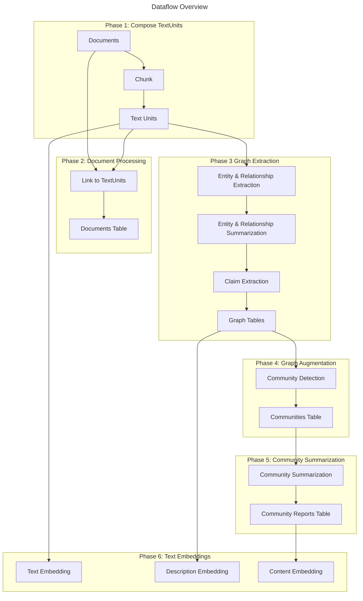
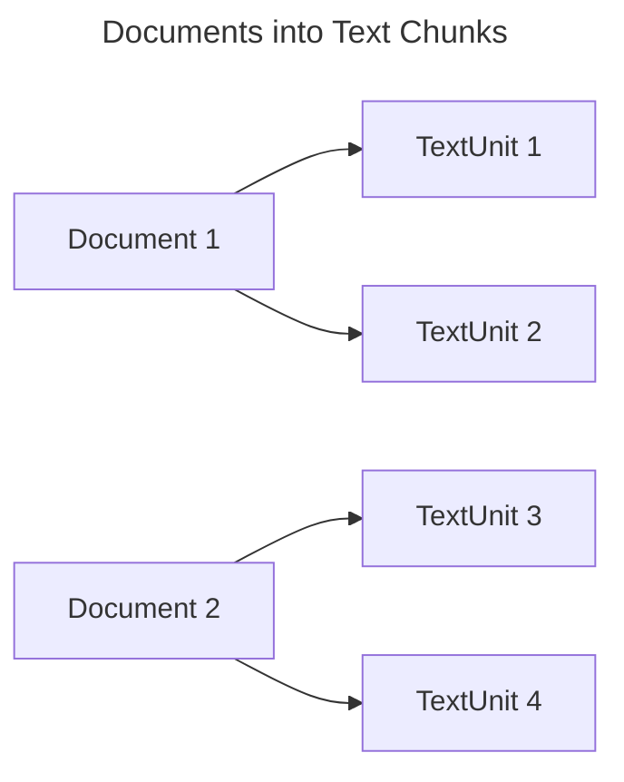
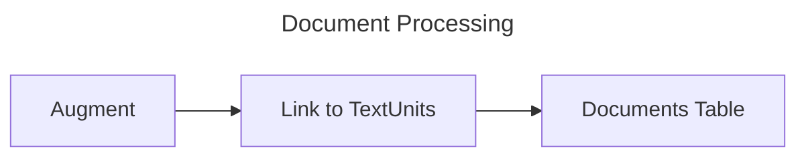
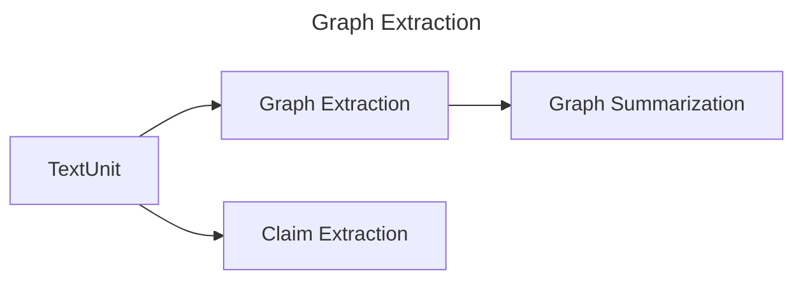
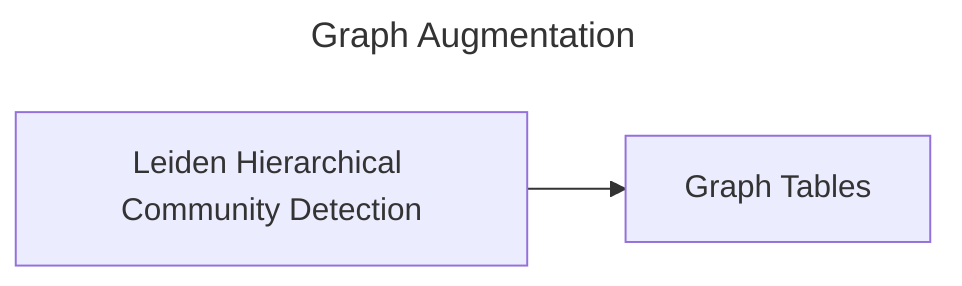
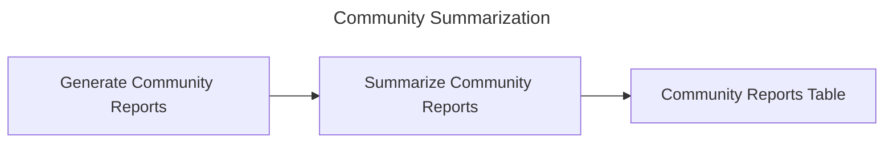
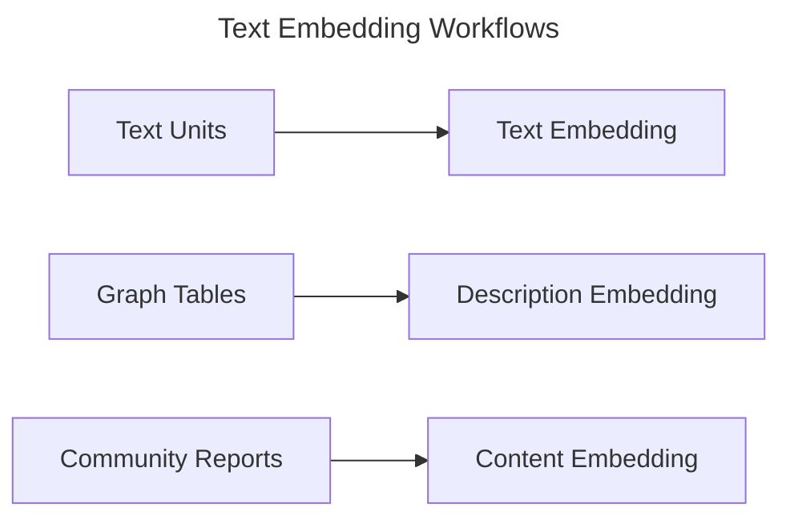

# Indexing Dataflow

## The GraphRAG Knowledge Model

The knowledge model is a specification for data outputs that conform to our data-model definition. You can find these definitions in the python/graphrag/graphrag/model folder within the GraphRAG repository. The following entity types are provided. The fields here represent the fields that are text-embedded by default.

- `Document` - An input document into the system. These either represent individual rows in a CSV or individual .txt files.
- `TextUnit` - A chunk of text to analyze. The size of these chunks, their overlap, and whether they adhere to any data boundaries may be configured below.
- `Entity` - An entity extracted from a TextUnit. These represent people, places, events, or some other entity-model that you provide.
- `Relationship` - A relationship between two entities.
- `Covariate` - Extracted claim information, which contains statements about entities which may be time-bound.
- `Community` - Once the graph of entities and relationships is built, we perform hierarchical community detection on them to create a clustering structure.
- `Community Report` - The contents of each community are summarized into a generated report, useful for human reading and downstream search.

## The Default Configuration Workflow

Let's take a look at how the default-configuration workflow transforms text documents into the _GraphRAG Knowledge Model_. This page gives a general overview of the major steps in this process. To fully configure this workflow, check out the [configuration](../config/overview.md) documentation.

## Phase 1: Compose TextUnits

The first phase of the default-configuration workflow is to transform input documents into _TextUnits_. A _TextUnit_ is a chunk of text that is used for our graph extraction techniques. They are also used as source-references by extracted knowledge items in order to empower breadcrumbs and provenance by concepts back to their original source text.

The chunk size (counted in tokens), is user-configurable. By default this is set to 1200 tokens. Larger chunks result in lower-fidelity output and less meaningful reference texts; however, using larger chunks can result in much faster processing time.

## Phase 2: Document Processing

In this phase of the workflow, we create the _Documents_ table for the knowledge model. Final documents are not used directly in GraphRAG, but this step links them to their constituent text units for provenance in your own applications.

### Link to TextUnits

In this step, we link each document to the text-units that were created in the first phase. This allows us to understand which documents are related to which text-units and vice-versa.

### Documents Table

At this point, we can export the **Documents** table into the knowledge Model.

## Phase 3: Graph Extraction

In this phase, we analyze each text unit and extract our graph primitives: _Entities_, _Relationships_, and _Claims_.
Entities and Relationships are extracted at once in our _extract_graph_ workflow, and claims are extracted in our _extract_claims_ workflow. Results are then combined and passed into following phases of the pipeline.

> Note: if you are using the [FastGraphRAG](https://microsoft.github.io/graphrag/index/methods/#fastgraphrag) option, entity and relationship extraction will be performed using NLP to conserve LLM resources, and claim extraction will always be skipped.

### Entity & Relationship Extraction

In this first step of graph extraction, we process each text-unit to extract entities and relationships out of the raw text using the LLM. The output of this step is a subgraph-per-TextUnit containing a list of **entities** with a _title_, _type_, and _description_, and a list of **relationships** with a _source_, _target_, and _description_.

These subgraphs are merged together - any entities with the same _title_ and _type_ are merged by creating an array of their descriptions. Similarly, any relationships with the same _source_ and _target_ are merged by creating an array of their descriptions.

### Entity & Relationship Summarization

Now that we have a graph of entities and relationships, each with a list of descriptions, we can summarize these lists into a single description per entity and relationship. This is done by asking the LLM for a short summary that captures all of the distinct information from each description. This allows all of our entities and relationships to have a single concise description.

### Claim Extraction (optional)

Finally, as an independent workflow, we extract claims from the source TextUnits. These claims represent positive factual statements with an evaluated status and time-bounds. These get exported as a primary artifact called **Covariates**.

Note: claim extraction is _optional_ and turned off by default. This is because claim extraction generally requires prompt tuning to be useful.

## Phase 4: Graph Augmentation

Now that we have a usable graph of entities and relationships, we want to understand their community structure. These give us explicit ways of understanding the organization of our graph.

### Community Detection

In this step, we generate a hierarchy of entity communities using the Hierarchical Leiden Algorithm. This method will apply a recursive community-clustering to our graph until we reach a community-size threshold. This will allow us to understand the community structure of our graph and provide a way to navigate and summarize the graph at different levels of granularity.

### Graph Tables

Once our graph augmentation steps are complete, the final **Entities**, **Relationships**, and **Communities** tables are exported.

## Phase 5: Community Summarization

At this point, we have a functional graph of entities and relationships and a hierarchy of communities for the entities.

Now we want to build on the communities data and generate reports for each community. This gives us a high-level understanding of the graph at several points of graph granularity. For example, if community A is the top-level community, we'll get a report about the entire graph. If the community is lower-level, we'll get a report about a local cluster.

### Generate Community Reports

In this step, we generate a summary of each community using the LLM. This will allow us to understand the distinct information contained within each community and provide a scoped understanding of the graph, from either a high-level or a low-level perspective. These reports contain an executive overview and reference the key entities, relationships, and claims within the community sub-structure.

### Summarize Community Reports

In this step, each _community report_ is then summarized via the LLM for shorthand use.

### Community Reports Table

At this point, some bookkeeping work is performed and we export the **Community Reports** tables.

## Phase 6: Text Embedding

For all artifacts that require downstream vector search, we generate text embeddings as a final step. These embeddings are written directly to a configured vector store. By default we embed entity descriptions, text unit text, and community report text.

---

# 日本語訳

# インデックスのデータフロー

## GraphRAG Knowledge Model

Knowledge model は、私たちの data model 定義に一致するデータ出力の仕様です。これらの定義は、GraphRAG リポジトリ内の `python/graphrag/graphrag/model` フォルダにあります。以下の entity type が提供されています。ここにあるフィールドは、既定で text embedding の対象となるものです。

- `Document` - システムへの入力文書です。CSV の各行、または個々の `.txt` ファイルに相当します。
- `TextUnit` - 分析対象のテキストの断片です。これらの chunk のサイズ、重なり、データ境界に従うかどうかは下で設定できます。
- `Entity` - TextUnit から抽出された entity です。人、場所、出来事、または独自に定義した entity モデルなどを表します。
- `Relationship` - 2 つの entity の関係です。
- `Covariate` - entity に関する抽出済みの claim 情報で、時間に依存する文を含むことがあります。
- `Community` - entity と relationship のグラフを構築したあと、その階層的な community detection を行ってクラスタ構造を作ります。
- `Community Report` - 各 community の内容を要約した生成レポートで、人間が読む用途や下流の検索に役立ちます。

## デフォルト設定ワークフロー

デフォルト設定の workflow が、テキスト文書を GraphRAG Knowledge Model に変換する流れを見ていきましょう。このページでは主な手順を概観します。詳細な設定は [configuration](../config/overview.md) のドキュメントを参照してください。

## Phase 1: TextUnit の作成

デフォルト設定ワークフローの最初の段階は、入力文書を TextUnit に変換することです。TextUnit は、graph extraction の手法で使う chunk です。また、抽出された knowledge item の source reference としても使われ、由来となる元テキストへの breadcrumbs と provenance を提供します。

chunk size はトークン数で数えられ、ユーザーが設定できます。既定値は 1200 トークンです。chunk を大きくすると出力の忠実度や参照テキストの意味合いは下がりますが、処理は速くなります。

## Phase 2: 文書処理

この段階では、Knowledge Model の `Documents` テーブルを作成します。最終文書は GraphRAG で直接使うわけではありませんが、この手順により、文書と構成 TextUnit を関連付けて、自分のアプリケーションで provenance を保持できます。

### TextUnit へのリンク

この手順では、各文書を、第一段階で作成した text unit に関連付けます。これにより、どの文書がどの text unit に対応しているか、逆にどの text unit がどの文書に属するかを把握できます。

### Documents テーブル

ここで `Documents` テーブルを Knowledge Model に出力できます。

## Phase 3: Graph Extraction

この段階では、各 text unit を解析し、`Entity`、`Relationship`、`Claim` という graph primitive を抽出します。
Entity と Relationship は `extract_graph` workflow で同時に抽出され、Claim は `extract_claims` workflow で抽出されます。結果はその後のパイプライン段階に渡されます。

> 注: [FastGraphRAG](https://microsoft.github.io/graphrag/index/methods/#fastgraphrag) を使う場合、entity と relationship の抽出は NLP で行われ、LLM 資源を節約します。また claim extraction は常にスキップされます。

### Entity & Relationship Extraction

graph extraction の最初の手順では、各 text unit を LLM で処理して、生テキストから entity と relationship を抽出します。この手順の出力は、各 TextUnit ごとのサブグラフで、`title`、`type`、`description` を持つ **entities** の一覧と、`source`、`target`、`description` を持つ **relationships** の一覧を含みます。

これらのサブグラフはまとめられ、`title` と `type` が同じ entity は、説明を配列として保持する形でマージされます。同様に、`source` と `target` が同じ relationship も、説明の配列としてマージされます。

### Entity & Relationship Summarization

entity と relationship のグラフができ、それぞれに説明の一覧があるので、各 entity と relationship について 1 つの説明に要約できます。これは、LLM に対して各説明に含まれる個別情報をすべて取り込んだ短い要約を作らせることで実現します。これにより、すべての entity と relationship に簡潔な単一説明を与えられます。

### Claim Extraction (optional)

最後に、独立した workflow として、元の TextUnit から claim を抽出します。これらの claim は、評価済みの状態と時間的な制約を持つ、肯定的な事実文を表します。これらは **Covariates** という主要成果物として出力されます。

注: claim extraction は任意であり、既定では無効です。通常、claim extraction は有用にするために prompt tuning が必要だからです。

## Phase 4: Graph Augmentation

entity と relationship の有用なグラフができたので、次はその community 構造を理解したいところです。これにより、グラフの構造を明示的に把握できます。

### Community Detection

この手順では、Hierarchical Leiden Algorithm を使って entity community の階層を生成します。この方法は、community サイズのしきい値に達するまで、グラフに再帰的な community clustering を適用します。これにより、グラフの community 構造を理解し、異なる粒度でグラフをたどったり要約したりできるようになります。

### Graph Tables

graph augmentation の手順が完了すると、最終的な `Entities`、`Relationships`、`Communities` テーブルが出力されます。

## Phase 5: Community Summarization

この時点で、entity と relationship の機能的なグラフと、その entity に対する community 階層ができています。

次に、community データをもとに各 community の report を生成します。これにより、グラフを複数の粒度で高水準に理解できます。たとえば、community A が最上位の community なら、グラフ全体に関する report が得られます。より下位の community なら、局所的なクラスタに関する report が得られます。

### Community Reports の生成

この手順では、LLM を使って各 community の要約を生成します。これにより、各 community に含まれる固有の情報を理解でき、高位・低位のどちらの視点からでも、範囲を絞ったグラフ理解が可能になります。これらの report には、要点の概観と、community の部分構造内にある重要な entity、relationship、claim が含まれます。

### Community Reports の要約

この手順では、各 `community report` を短縮表現として使えるよう、LLM でさらに要約します。

### Community Reports テーブル

ここで bookkeeping の処理が行われ、`Community Reports` テーブルを出力します。

## Phase 6: Text Embedding

下流の vector search に使う必要がある成果物については、最後に text embedding を生成します。これらの embedding は設定済みの vector store に直接書き込まれます。既定では、entity description、text unit text、community report text を埋め込みます。

