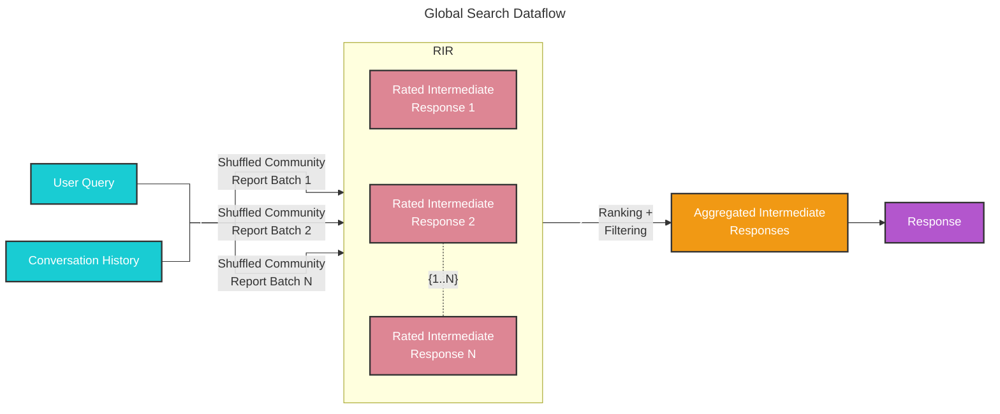
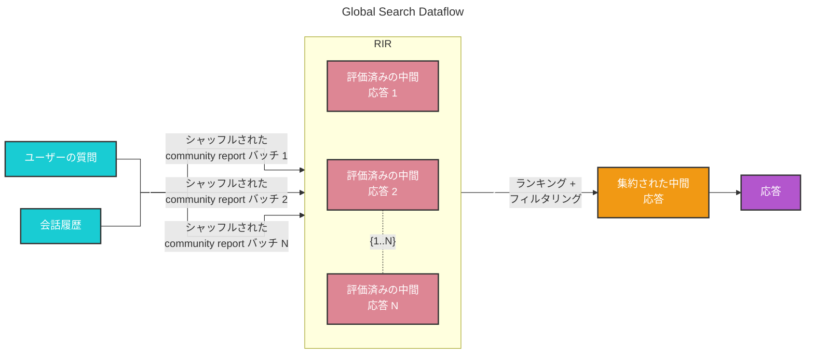

# Global Search 🔎

## Whole Dataset Reasoning

Baseline RAG struggles with queries that require aggregation of information across the dataset to compose an answer. Queries such as “What are the top 5 themes in the data?” perform terribly because baseline RAG relies on a vector search of semantically similar text content within the dataset. There is nothing in the query to direct it to the correct information.

However, with GraphRAG we can answer such questions, because the structure of the LLM-generated knowledge graph tells us about the structure (and thus themes) of the dataset as a whole. This allows the private dataset to be organized into meaningful semantic clusters that are pre-summarized. Using our [global search](https://github.com/microsoft/graphrag/blob/main//graphrag/query/structured_search/global_search/) method, the LLM uses these clusters to summarize these themes when responding to a user query.

## Methodology

Given a user query and, optionally, the conversation history, the global search method uses a collection of LLM-generated community reports from a specified level of the graph's community hierarchy as context data to generate response in a map-reduce manner. At the `map` step, community reports are segmented into text chunks of pre-defined size. Each text chunk is then used to produce an intermediate response containing a list of point, each of which is accompanied by a numerical rating indicating the importance of the point. At the `reduce` step, a filtered set of the most important points from the intermediate responses are aggregated and used as the context to generate the final response. 

The quality of the global search’s response can be heavily influenced by the level of the community hierarchy chosen for sourcing community reports. Lower hierarchy levels, with their detailed reports, tend to yield more thorough responses, but may also increase the time and LLM resources needed to generate the final response due to the volume of reports.

## Configuration

Below are the key parameters of the [GlobalSearch class](https://github.com/microsoft/graphrag/blob/main//graphrag/query/structured_search/global_search/search.py):

* `model`: Language model chat completion object to be used for response generation
* `context_builder`: [context builder](https://github.com/microsoft/graphrag/blob/main//graphrag/query/structured_search/global_search/community_context.py) object to be used for preparing context data from community reports
* `map_system_prompt`: prompt template used in the `map` stage. Default template can be found at [map_system_prompt](https://github.com/microsoft/graphrag/blob/main//graphrag/prompts/query/global_search_map_system_prompt.py)
* `reduce_system_prompt`: prompt template used in the `reduce` stage, default template can be found at [reduce_system_prompt](https://github.com/microsoft/graphrag/blob/main//graphrag/prompts/query/global_search_reduce_system_prompt.py)
* `response_type`: free-form text describing the desired response type and format (e.g., `Multiple Paragraphs`, `Multi-Page Report`)
* `allow_general_knowledge`: setting this to True will include additional instructions to the `reduce_system_prompt` to prompt the LLM to incorporate relevant real-world knowledge outside of the dataset. Note that this may increase hallucinations, but can be useful for certain scenarios. Default is False
*`general_knowledge_inclusion_prompt`: instruction to add to the `reduce_system_prompt` if `allow_general_knowledge` is enabled. Default instruction can be found at [general_knowledge_instruction](https://github.com/microsoft/graphrag/blob/main//graphrag/prompts/query/global_search_knowledge_system_prompt.py)
* `max_data_tokens`: token budget for the context data
* `map_llm_params`: a dictionary of additional parameters (e.g., temperature, max_tokens) to be passed to the LLM call at the `map` stage
* `reduce_llm_params`: a dictionary of additional parameters (e.g., temperature, max_tokens) to passed to the LLM call at the `reduce` stage
* `context_builder_params`: a dictionary of additional parameters to be passed to the [`context_builder`](https://github.com/microsoft/graphrag/blob/main//graphrag/query/structured_search/global_search/community_context.py) object when building context window for the `map` stage.
* `concurrent_coroutines`: controls the degree of parallelism in the `map` stage.
* `callbacks`: optional callback functions, can be used to provide custom event handlers for LLM's completion streaming events

## How to Use

An example of a global search scenario can be found in the following [notebook](../examples_notebooks/global_search.ipynb).

---

# 日本語訳

# Global Search 🔎

## 全体データセット推論

Baseline RAG は、回答を組み立てるためにデータセット全体にわたる情報の集約を必要とするクエリが苦手です。たとえば、「データ中の上位 5 つのテーマは何か？」のようなクエリは非常に性能が悪くなります。これは、baseline RAG がデータセット内で意味的に類似した text content に対する vector search に依存しているためです。クエリ自体には、正しい情報へ導く手がかりがありません。

しかし GraphRAG では、そのような質問に答えることができます。なぜなら、LLM が生成した knowledge graph の構造が、データセット全体の構造、ひいてはテーマを示しているからです。これにより、プライベートなデータセットを意味のある semantic cluster に整理し、事前に要約しておくことができます。[global search](https://github.com/microsoft/graphrag/blob/main//graphrag/query/structured_search/global_search/) メソッドを使うと、LLM はこれらの cluster を使って、ユーザーのクエリに応答する際にそれらのテーマを要約します。

## 方法論

ユーザーの質問と、必要に応じて会話履歴を与えると、global search メソッドは、グラフの community 階層の指定レベルから取得した LLM 生成の community report のコレクションをコンテキストデータとして使い、map-reduce 方式で応答を生成します。`map` ステップでは、community report はあらかじめ定義されたサイズの text chunk に分割されます。各 text chunk は、箇条書きのリストを含む中間応答の生成に使われ、それぞれの箇条書きには、その要点の重要度を示す数値評価が付随します。`reduce` ステップでは、中間応答から最も重要な要点を抽出して集約し、最終応答を生成するためのコンテキストとして使用します。

community report を取得するために選択する community 階層のレベルは、global search の応答品質に大きく影響します。下位の階層レベルは、より詳細な report を持つため、より完全な応答につながりやすい一方で、report の量が多いため、最終応答の生成に必要な時間と LLM リソースが増える可能性があります。

## 構成

以下は、[GlobalSearch class](https://github.com/microsoft/graphrag/blob/main//graphrag/query/structured_search/global_search/search.py) の主要なパラメータです。

* `model`: 応答生成に使用する言語モデルの chat completion オブジェクト
* `context_builder`: community report からコンテキストデータを準備するために使用する [context builder](https://github.com/microsoft/graphrag/blob/main//graphrag/query/structured_search/global_search/community_context.py) オブジェクト
* `map_system_prompt`: `map` ステージで使用する prompt template。既定テンプレートは [map_system_prompt](https://github.com/microsoft/graphrag/blob/main//graphrag/prompts/query/global_search_map_system_prompt.py) を参照
* `reduce_system_prompt`: `reduce` ステージで使用する prompt template。既定テンプレートは [reduce_system_prompt](https://github.com/microsoft/graphrag/blob/main//graphrag/prompts/query/global_search_reduce_system_prompt.py) を参照
* `response_type`: 望ましい応答の種類と形式を自由記述する文字列（例: `Multiple Paragraphs`, `Multi-Page Report`）
* `allow_general_knowledge`: これを True にすると、`reduce_system_prompt` に追加の指示が含まれ、LLM がデータセット外の現実世界の関連知識を取り込むよう促す。なお、幻覚の可能性は増えるが、特定の場面では有用。既定値は False
* `general_knowledge_inclusion_prompt`: `allow_general_knowledge` が有効なときに `reduce_system_prompt` に追加する指示。既定の指示は [general_knowledge_instruction](https://github.com/microsoft/graphrag/blob/main//graphrag/prompts/query/global_search_knowledge_system_prompt.py) を参照
* `max_data_tokens`: コンテキストデータの token 予算
* `map_llm_params`: `map` ステージでの LLM 呼び出しに渡す追加パラメータ（例: temperature, max_tokens）の辞書
* `reduce_llm_params`: `reduce` ステージでの LLM 呼び出しに渡す追加パラメータ（例: temperature, max_tokens）の辞書
* `context_builder_params`: `map` ステージのコンテキストウィンドウを構築するときに [`context_builder`](https://github.com/microsoft/graphrag/blob/main//graphrag/query/structured_search/global_search/community_context.py) オブジェクトへ渡す追加パラメータの辞書
* `concurrent_coroutines`: `map` ステージの並列度を制御する
* `callbacks`: 任意の callback 関数。LLM の completion ストリーミングイベントに対するカスタムイベントハンドラとして使用できる

## 使い方

global search のシナリオの例は、次の [notebook](../examples_notebooks/global_search.ipynb) にあります。
