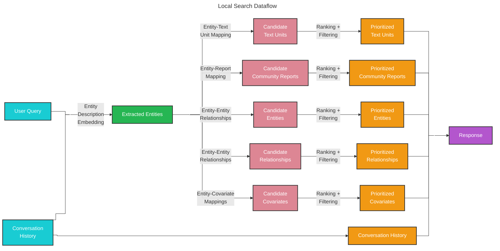
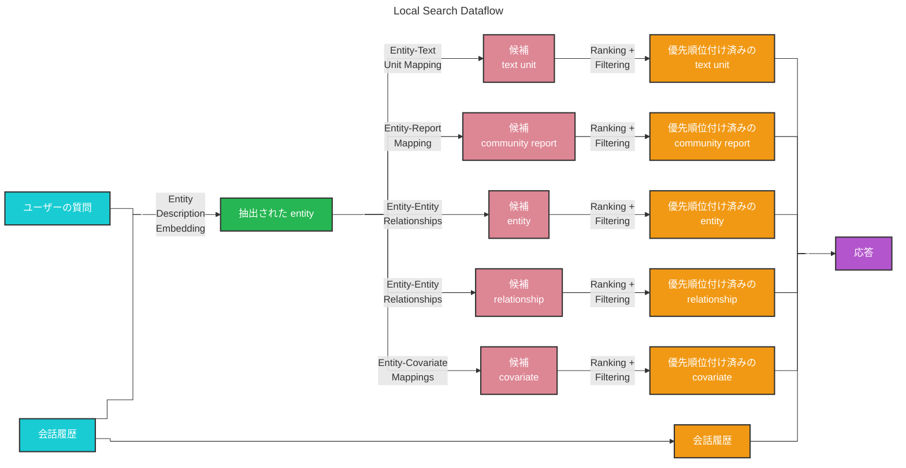

# Local Search 🔎

## Entity-based Reasoning

The [local search](https://github.com/microsoft/graphrag/blob/main//graphrag/query/structured_search/local_search/) method combines structured data from the knowledge graph with unstructured data from the input documents to augment the LLM context with relevant entity information at query time. It is well-suited for answering questions that require an understanding of specific entities mentioned in the input documents (e.g., “What are the healing properties of chamomile?”).

## Methodology

Given a user query and, optionally, the conversation history, the local search method identifies a set of entities from the knowledge graph that are semantically-related to the user input. These entities serve as access points into the knowledge graph, enabling the extraction of further relevant details such as connected entities, relationships, entity covariates, and community reports. Additionally, it also extracts relevant text chunks from the raw input documents that are associated with the identified entities. These candidate data sources are then prioritized and filtered to fit within a single context window of pre-defined size, which is used to generate a response to the user query.

## Configuration

Below are the key parameters of the [LocalSearch class](https://github.com/microsoft/graphrag/blob/main//graphrag/query/structured_search/local_search/search.py):

* `model`: Language model chat completion object to be used for response generation
* `context_builder`: [context builder](https://github.com/microsoft/graphrag/blob/main//graphrag/query/structured_search/local_search/mixed_context.py) object to be used for preparing context data from collections of knowledge model objects
* `system_prompt`: prompt template used to generate the search response. Default template can be found at [system_prompt](https://github.com/microsoft/graphrag/blob/main//graphrag/prompts/query/local_search_system_prompt.py)
* `response_type`: free-form text describing the desired response type and format (e.g., `Multiple Paragraphs`, `Multi-Page Report`)
* `llm_params`: a dictionary of additional parameters (e.g., temperature, max_tokens) to be passed to the LLM call
* `context_builder_params`: a dictionary of additional parameters to be passed to the [`context_builder`](https://github.com/microsoft/graphrag/blob/main//graphrag/query/structured_search/local_search/mixed_context.py) object when building context for the search prompt
* `callbacks`: optional callback functions, can be used to provide custom event handlers for LLM's completion streaming events

## How to Use

An example of a local search scenario can be found in the following [notebook](../examples_notebooks/local_search.ipynb).

---

# 日本語訳

# Local Search 🔎

## エンティティベースの推論

[local search](https://github.com/microsoft/graphrag/blob/main//graphrag/query/structured_search/local_search/) メソッドは、知識グラフの構造化データと入力文書の非構造化データを組み合わせ、クエリ時に関連する entity 情報で LLM のコンテキストを拡張します。これは、入力文書内で言及されている特定の entity の理解を必要とする質問に適しています。たとえば、「カモミールの治癒特性は何か？」のような質問です。

## 方法論

ユーザーの質問と、必要に応じて会話履歴を与えると、local search メソッドは、知識グラフ内からユーザー入力と意味的に関連する entity の集合を特定します。これらの entity は知識グラフへのアクセスポイントとして機能し、接続された entity、relationship、entity covariate、community report など、さらに関連する詳細の抽出を可能にします。加えて、識別された entity に関連する入力文書の生の text chunk も抽出します。これらの候補データソースは、その後、あらかじめ定義されたサイズの単一コンテキストウィンドウに収まるよう優先順位付けとフィルタリングが行われ、ユーザーの質問に対する応答を生成するために使われます。

## 構成

以下は、[LocalSearch class](https://github.com/microsoft/graphrag/blob/main//graphrag/query/structured_search/local_search/search.py) の主要なパラメータです。

* `model`: 応答生成に使用する言語モデルの chat completion オブジェクト
* `context_builder`: 知識モデルオブジェクトの集合からコンテキストデータを準備するために使用する [context builder](https://github.com/microsoft/graphrag/blob/main//graphrag/query/structured_search/local_search/mixed_context.py) オブジェクト
* `system_prompt`: 検索応答を生成するための prompt template。既定テンプレートは [system_prompt](https://github.com/microsoft/graphrag/blob/main//graphrag/prompts/query/local_search_system_prompt.py) を参照
* `response_type`: 望ましい応答の種類と形式を自由記述する文字列（例: `Multiple Paragraphs`, `Multi-Page Report`）
* `llm_params`: LLM 呼び出しに渡す追加パラメータ（例: temperature, max_tokens）の辞書
* `context_builder_params`: 検索 prompt のためのコンテキストを構築するときに [`context_builder`](https://github.com/microsoft/graphrag/blob/main//graphrag/query/structured_search/local_search/mixed_context.py) オブジェクトへ渡す追加パラメータの辞書
* `callbacks`: 任意の callback 関数。LLM の completion ストリーミングイベントに対するカスタムイベントハンドラとして使用できる

## 使い方

local search のシナリオの例は、次の [notebook](../examples_notebooks/local_search.ipynb) にあります。
